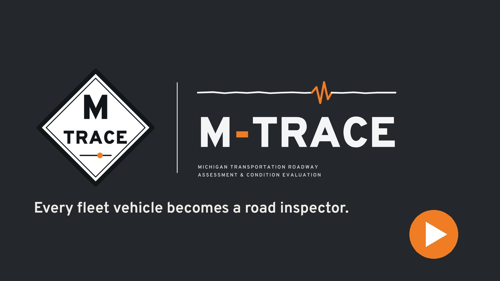
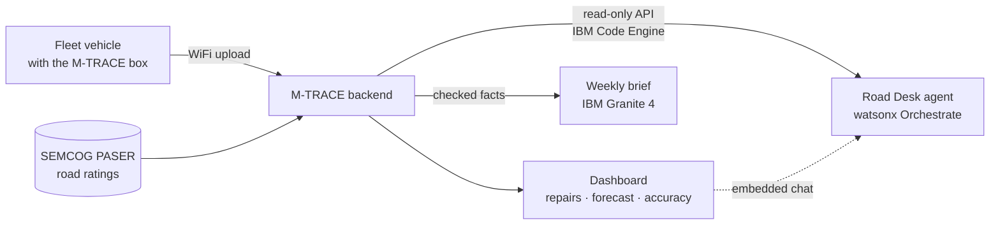
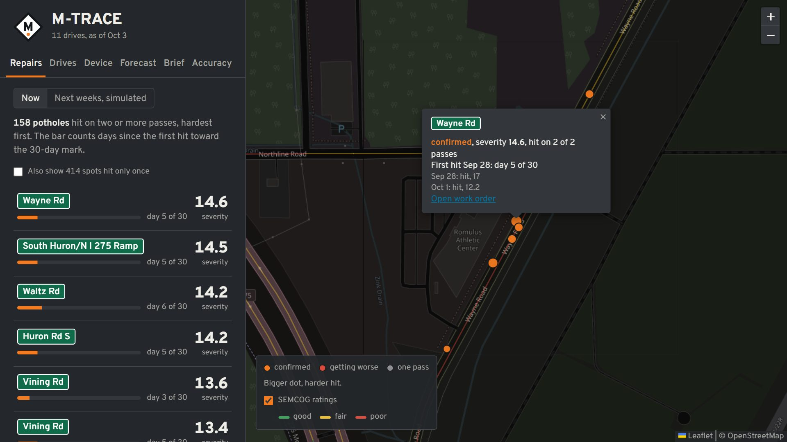
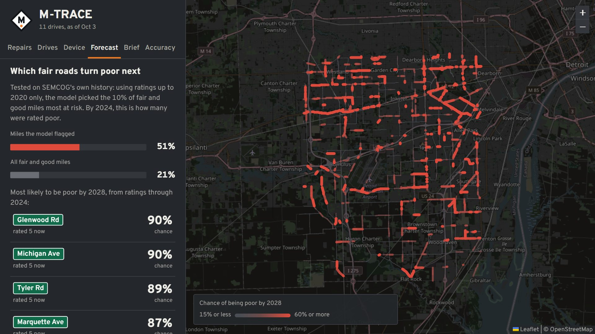
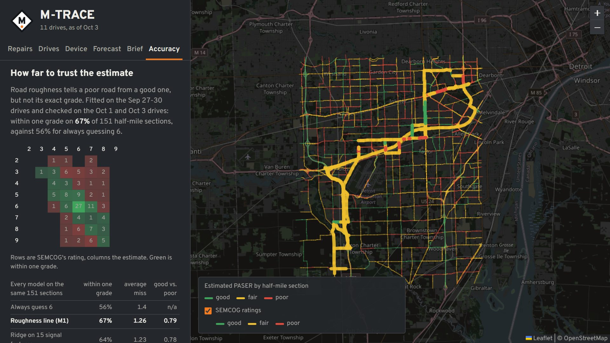
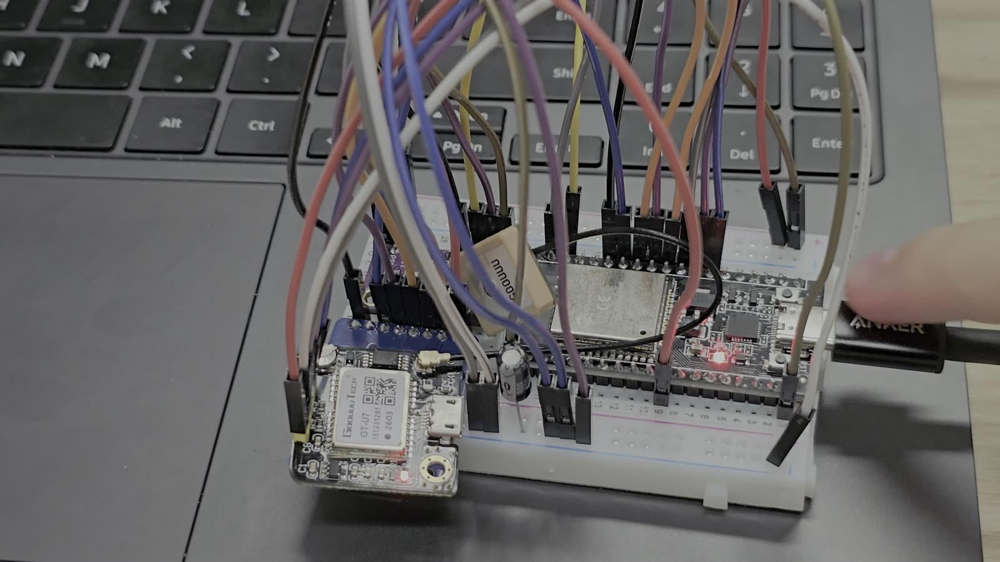

<div align="center">

<picture>
  <source media="(prefers-color-scheme: dark)" srcset="brand/m-trace-horizontal-dark.svg">
  
</picture>

### Every fleet vehicle becomes a road inspector.

A $100 box rides in the trucks a road agency already runs. It measures every 50 meters of road, finds potholes, and keeps a 30-day clock on each one, so crews fix what matters before it turns into a liability.


[**Watch the demo**](https://youtu.be/J80AxYNAM8M) · [How it works](#how-it-works) · [Results](#results) · [Developer guide](docs/developers.md)

<a href="https://youtu.be/J80AxYNAM8M"></a>

</div>

## The problem

<table>
<tr>
<td align="center" width="33%"><h1>30 days</h1>Once a defect has been readily apparent for 30 days, Michigan law presumes the road agency knew about it (MCL 691.1403).</td>
<td align="center" width="33%"><h1>About 6%</h1>of Michigan's local, non-federal-aid lane miles had PASER rating data in 2017. Agencies aren't required to rate them.</td>
<td align="center" width="33%"><h1>$772</h1>a year: what rough roads cost the average Michigan driver in extra vehicle costs (TRIP, 2025).</td>
</tr>
</table>

Potholes mostly get reported by residents, and even federal-aid roads get a PASER rating only once every two years. Fleet vehicles already drive every road, every week. M-TRACE makes those trips measure the road.

## How it works

1. **Measure.** The box sits in any fleet vehicle. It reads a motion sensor 100 times a second and GPS 5 times a second, scores the roughness of every 50 m of road, and flags severe hits, all on the board itself.
2. **Upload.** Results queue on the SD card and upload over WiFi whenever there's a connection. Nothing is lost while the truck is out of range.
3. **Match.** Roughness is corrected for speed and matched to SEMCOG's PASER road segments by position and direction of travel, so every measurement lands on a real, named road.
4. **Act.** A hit becomes a confirmed pothole once it shows up on two or more passes. Each one gets a 30-day clock from its first hit and a printable work order, hardest first.



## What a road agency gets

<table>
<tr>
<td width="50%"></td>
<td width="50%"></td>
</tr>
<tr>
<td><b>Repairs.</b> Confirmed potholes, hardest first, each with the days left on its 30-day clock. One click opens a work order for the crew.</td>
<td><b>Forecast.</b> Which fair and good roads are most likely to turn poor by 2028, so a fixed budget goes to sealing roads before they need rebuilding.</td>
</tr>
<tr>
<td></td>
<td></td>
</tr>
<tr>
<td><b>Accuracy.</b> Measured roughness becomes an estimated PASER grade, so roads nobody rates get one. The page shows exactly how far to trust it.</td>
<td><b>The box.</b> ESP32, motion sensor, GPS and an SD card. Press its button and it replays a logged drive through the same detection it runs in the truck.</td>
</tr>
</table>

Ask the **Road Desk** agent questions in plain English ("which potholes are close to their 30-day deadline?") and a weekly brief written by IBM Granite 4 sums up what changed. Neither one invents numbers: the agent answers only through tools that call M-TRACE's API, and any brief containing a number that isn't in the computed facts is rejected and rewritten.

## Results

From 11 drives covering 179 miles in southeast Michigan, Sep 27 to Oct 3:

| Result | What it means |
|---|---|
| **158** confirmed potholes | found on two or more passes, out of 572 spots hit (414 seen once so far) |
| **67%** within one PASER grade | on 151 half-mile sections from drives the model never saw, against 56% for always guessing a 6. It never called a good road poor. |
| **51%** vs 21% | Backtested on SEMCOG's own history: of the fair and good miles the forecast flagged as riskiest in 2020, 51% were rated poor by 2024, against 21% of all fair and good miles. |
| **799 of 799** hits | The device's on-board detection matches the backend exactly on every drive, along with all 5,758 roughness windows. |

Every model is scored on data it never trained on, next to a simple baseline.

## What's in the box

| Part | Price |
|---|---|
| ESP32 dev board | $15.00 |
| BNO085 motion sensor | $29.50 |
| GT-U7 GPS module | $13.99 |
| MicroSD breakout and 8 GB card | $31.00 |
| ABS enclosure | $5.99 |
| Jumper wires | $1.95 |
| **About $100 per box** | **$97.43** |

Single-unit retail prices, an estimate; fleet volume would be lower. Each part's source is in [demo/sources.md](demo/sources.md#estimated-parts-cost).

## Built for Michigan

- **Who buys it:** Michigan's 83 county road agencies, which maintain 90,484 miles of road (75% of the state's roads), and its cities. Priced per vehicle per year.
- **Coverage grows with trucks, not staff:** every vehicle added covers its own routes, and more vehicles on the same road confirm potholes sooner.
- **Michigan jobs:** boxes assembled in Michigan and calibrated by Michigan's PASER raters, trained by Michigan Tech's Center for Technology and Training.
- **Why it pays:** rebuilding a road costs 5 to 8 times more per lane mile than preventive maintenance. Knowing which fair roads are slipping is how a fixed budget goes further.

## Built on IBM

| Service | What it does |
|---|---|
| **watsonx Orchestrate** | Hosts the Road Desk agent and its seven tools, and the flow that writes the weekly brief. |
| **IBM Granite 4** | Writes the weekly brief from computed facts, checked number by number. |
| **IBM Code Engine** | Runs M-TRACE's read-only API for the agent. It scales to zero when idle and never holds raw drive tracks. |
| **Granite TSPulse and TTM** | Tested as a roughness-to-PASER model and as a forecaster. |

### What didn't win, and why that's in here

A simple roughness line beat the more complex models at turning roughness into a PASER grade: Granite TSPulse reached 62% within one grade and a 15-feature ridge regression 64%, against the line's 67%. For forecasting, gradient boosting on rating history, road class, surface and lanes (62%) beat Granite TTM, which only sees the rating history (57% zero-shot, 56% fine-tuned). Saying which approach didn't win is part of the result.

## What's next

- Boxes in **several fleet vehicles**, so passes add up faster.
- A **season of data**, to watch roads change over months instead of one week.
- A check against a county's own **repair records**.

## Run it yourself

```
python pipeline.py      # raw drives + SEMCOG PASER segments -> data/out/*.json
python backend.py       # dashboard and API at http://localhost:8000
```

The [developer guide](docs/developers.md) covers the device firmware, the models and forecast, the IBM deployment, and the demo build. [Architecture](demo/architecture.md) explains how the pieces fit.

## Sources and credits

- Every outside figure here (the law, TRIP, SEMCOG, the county road association, parts prices) is sourced with a link and date in [demo/sources.md](demo/sources.md).
- Road ratings: SEMCOG PASER data. Map: Leaflet, with tiles © OpenStreetMap contributors.
- Demo video music: "A Product Demo" by MomotMusic, via Pixabay.
