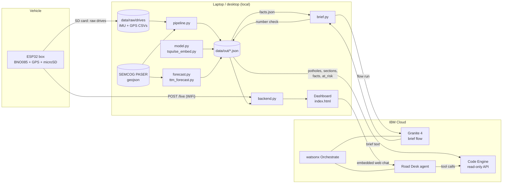

# M-TRACE architecture

## The device (`device/`)

ESP32 + BNO085 motion sensor + GT-U7 GPS + microSD, built with PlatformIO.

- **Sampling:** the BNO085 is read at 100 Hz. Each reading is rotated into the road's frame (vertical and lateral) using the sensor's orientation. GPS runs at 5 Hz.
- **Detection on the board:** `detect.h` cuts the drive into 50 m windows, gives each one a speed-normalized roughness, and flags severe hits. It is the same math as `pipeline.py`. `device/check.py` compiles it for the laptop and checks it against the pipeline on every logged drive.
- **Storage:** every hit and window goes onto a queue on the SD card (`/queue.jsonl`). The raw IMU and GPS stay on the card in `/drives/`, in the same CSV format the pipeline reads.
- **Upload:** when WiFi is up, the box posts the queue to the backend's `/live` and remembers how far the server has got (`/queue.pos`). Nothing is lost while it's offline.
- **Replay:** pressing BOOT replays a logged drive from the card through the same detector, so the live path can be shown without driving.
- **Config:** `/config.txt` on the card (WiFi, upload URL, replay file and speed), or the same `key=value` lines over serial.

## The pipeline (`pipeline.py`)

Raw drives plus SEMCOG's PASER segments in, map-ready JSON out.

1. GPS is interpolated onto the IMU timeline.
2. The moving part of each drive is cut into 50 m windows. Each window gets a roughness normalized to 20 m/s (roughness grows with speed^0.31, fitted from the same segments driven at different speeds).
3. Each window is snapped to the nearest PASER segment within 20 m running the same direction.
4. Severe hits are picked out of the raw signal: a speed-normalized peak above 4.5 m/s² and at least 3 times the surrounding road's level.
5. Hits within 15 m in the same direction of travel are clustered into one spot across drives. Each spot runs through a lifecycle over its passes: Suspected (one hit), Confirmed (two or more), Worsening, Repaired (three clean passes in a row), PatchFailed. Each spot carries a 30-day clock from first detection (MCL 691.1403).
6. Rated windows are grouped into half-mile sections. One line, PASER = a + b ln(roughness), is fitted on the September drives and scored on the October drives.
7. `facts.json` collects the plain-language facts the brief is written from.

## Models

- **Roughness to PASER (`model.py`):** every candidate is scored on the same held-out sections: always guessing 6, the roughness line, a ridge regression on 15 signal features, and IBM Granite TSPulse embeddings (`tspulse_embed.py`) alone and with roughness.
- **Forecast (`forecast.py`, `ttm_forecast.py`):** which fair or good roads fall to poor (PASER 1-4) in four years. It is backtested on SEMCOG's own PASER history (nothing after 2020, scored on the real 2024 ratings) against two baselines and IBM Granite TTM, zero-shot and fine-tuned. Gradient boosting won and gives each road its 2028 risk (`forecast.json`, `at_risk.json`).

## Backend and dashboard (`backend.py`, `index.html`)

`backend.py` is a single Python standard-library server.

- **Locally** it serves the dashboard, `data/out/`, the `/api/` endpoints, and `POST /live` for the device.
- **Publicly** (on Code Engine, or through a tunnel) it serves `/api/` only, because `data/out/` holds raw drive tracks. Every miss comes back as a sentence the agent has to repeat, never an empty list it could fill in.
- **API endpoints:** `/api/potholes`, `/api/road`, `/api/work_order`, `/api/summary`, `/api/at_risk`.

The dashboard is one page: a Leaflet map with a sidebar of views (Repairs, Drives, Device, Forecast, Brief, Accuracy). The Device view polls `live.jsonl` every second and draws what the box uploads. On a replay of a logged drive, it also rings the hits the backend found on that drive.

## IBM layer

- **Weekly brief:** `brief.py` sends `facts.json` to an Orchestrate flow (`orchestrate/weekly_brief.py`) running Granite 4 (`granite-4-h-small`, temperature 0). Any draft containing a number that isn't in the facts is rejected and regenerated.
- **Road Desk agent:** an Orchestrate agent (`orchestrate/road_desk.yaml`) with seven Python tools (`orchestrate/road_tools.py`): find potholes, potholes near the 30-day deadline, road condition, work order, roads at risk, network summary, and what a PASER rating means. Every number comes from a tool, never from the model. The dashboard embeds its web chat.
- **Code Engine:** `deploy_api.sh` runs `backend.py` in API-only mode on a stock Python image. Only the four data files the API reads are mounted, never drive tracks. It scales to zero when idle.

## Where things run

| Piece | Runs on | Talks to |
|---|---|---|
| Device | ESP32 in the vehicle | Backend `/live` over WiFi |
| Pipeline, models, forecast | Laptop | Local files |
| Backend + dashboard | Laptop | Device, browser |
| Read-only API | IBM Code Engine | Road Desk tools |
| Brief flow, Road Desk agent | watsonx Orchestrate | Granite 4 / the agent's model; Code Engine API |
